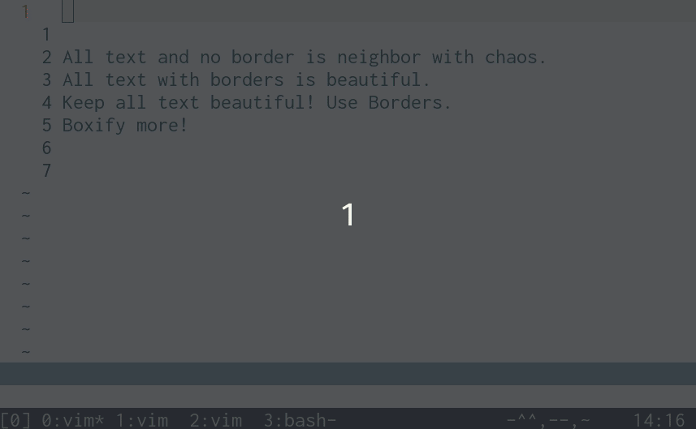

# boxify. A NeoVim plugin.

## Boxify some text

Use `V` and select text line-wise. Give command `Boxify` without changing the defaulted `:'<.'>`.

## Setup using Plug

Install with `Plug 'claes-magnus/boxify', { 'do': 'npm run build' }`, `:PlugInstall`, `:UpdateRemotePlugins`.

## Setup manually
Make sure to have NeoVim installed as well as the node-js client. Use `:checkhealth` to see if the node client is installed.

Usually, the NeoVim config is located at `~/.config/nvim`. If `rplugin` and the subfolder 
`node` does not exist, create this path: `mkdir ~/.config/nvim/rplugin/node/boxify -p`. NeoVim will look for plugins to use with its API in this folder. Copy the file `src/boxify.js`) to this path. From the root of this project, when cloned, you can also write `npm run build` (which attempts to copy `src/boxify.js` to `~/.config/nvim/rplugin/node/boxify`). Remember to `:UpdateRemotePlugins`.

